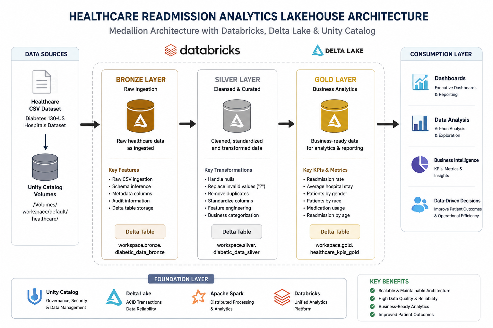
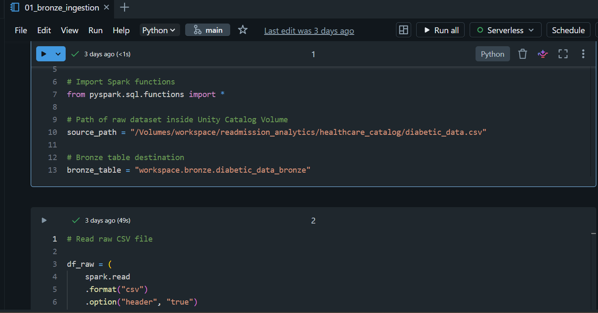
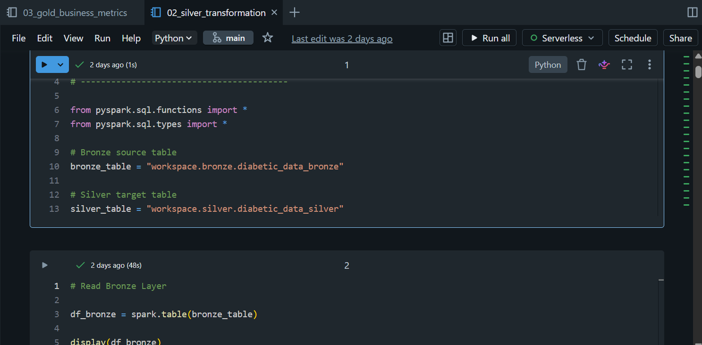
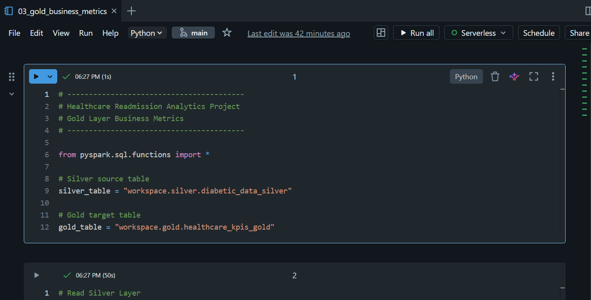
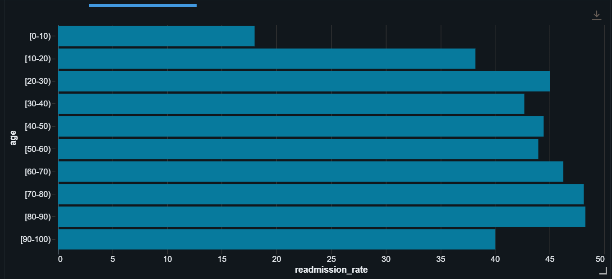
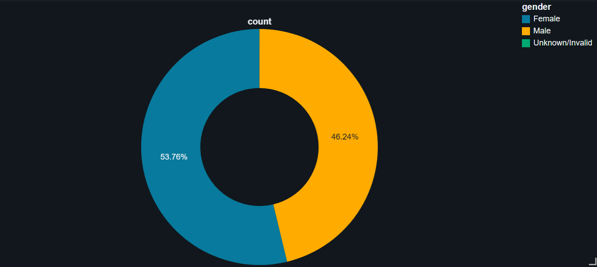
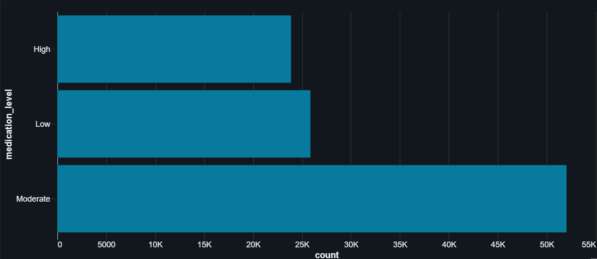
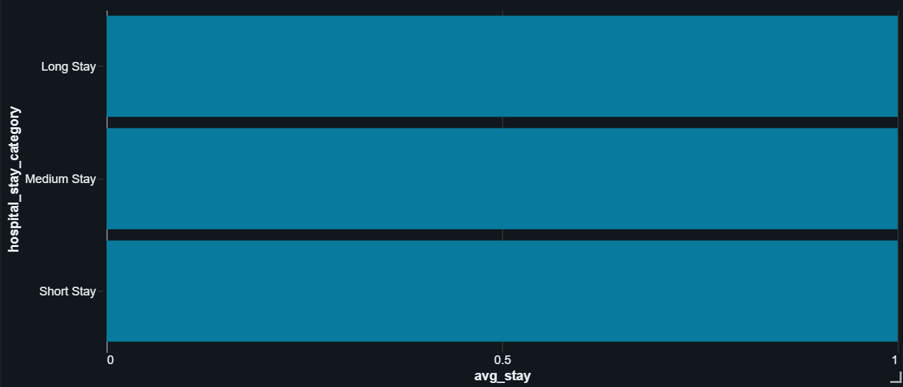

# Healthcare Readmission Analytics Lakehouse

## Descripción del Proyecto

Este proyecto implementa una arquitectura moderna de Data Lakehouse utilizando Databricks y la arquitectura Medallion (Bronze, Silver y Gold).

El objetivo principal es procesar datos hospitalarios relacionados con readmisiones de pacientes diabéticos, transformando datos crudos en métricas analíticas listas para dashboards y toma de decisiones.

El pipeline fue desarrollado siguiendo buenas prácticas de ingeniería de datos modernas usando Delta Lake, PySpark y Unity Catalog.

---

# Arquitectura del Proyecto



---

# Tecnologías Utilizadas

- Databricks
- Apache Spark
- PySpark
- Delta Lake
- Unity Catalog
- SQL
- Medallion Architecture
- Healthcare Analytics

---

# Flujo de la Arquitectura

```text
Raw CSV Dataset
       ↓
Bronze Layer (Raw Ingestion)
       ↓
Silver Layer (Data Cleaning & Feature Engineering)
       ↓
Gold Layer (Business KPIs & Analytics)
       ↓
Dashboards & Visualizations
```

---

# Dataset Utilizado

Se utilizó el dataset Healthcare Diabetes Readmission Dataset proveniente del UCI Machine Learning Repository.

El dataset contiene:
- Más de 100.000 registros hospitalarios
- Información de readmisiones
- Diagnósticos médicos
- Información demográfica
- Medicamentos suministrados
- Métricas hospitalarias

---

# Bronze Layer

La capa Bronze almacena los datos crudos provenientes del archivo CSV original.

En esta etapa se implementó:
- Ingesta de datos
- Inferencia de schema
- Metadata de trazabilidad
- Persistencia en Delta Tables

## Características principales:
- ingestion_timestamp
- source_file
- almacenamiento en formato Delta



---

# Silver Layer

La capa Silver se encarga de la limpieza, estandarización y transformación de los datos.

Transformaciones realizadas:
- Reemplazo de valores inválidos ("?")
- Limpieza de NULLs
- Eliminación de duplicados
- Renombramiento de columnas
- Feature Engineering
- Creación de categorías analíticas

## Nuevas columnas creadas:
- readmitted_flag
- hospital_stay_category
- medication_level



---

# Gold Layer

La capa Gold contiene métricas agregadas y KPIs orientados al análisis de negocio y dashboards ejecutivos.

KPIs generados:
- Tasa de readmisión hospitalaria
- Promedio de estancia hospitalaria
- Distribución de pacientes
- Uso de medicamentos
- Métricas analíticas hospitalarias



---

# Visualizaciones y Dashboards

## Readmisión por Edad



---

## Distribución por Género



---

## Distribución de Medicamentos



---

## Estancia Hospitalaria Promedio



---

# Insights Obtenidos

Algunos insights encontrados durante el análisis:

- Los grupos de mayor edad presentan mayores tasas de readmisión.
- Estancias hospitalarias largas suelen relacionarse con mayor cantidad de medicamentos.
- Los datos hospitalarios pueden transformarse en métricas útiles para toma de decisiones clínicas.
- La arquitectura Medallion facilita la trazabilidad y calidad de los datos.

---

# Estructura del Proyecto

```text
healthcare-readmission-lakehouse/
│
├── notebooks/
│   ├── 01_bronze_ingestion
│   ├── 02_silver_transformation
│   ├── 03_gold_business_metrics
│   ├── 04_visualizations
│
├── screenshots/
│   ├── architecture.png
│   ├── bronze_layer.png
│   ├── silver_layer.png
│   ├── gold_layer.png
│   ├── dashboard_readmission_age.png
│   ├── dashboard_gender_distribution.png
│   ├── dashboard_medication_distribution.png
│   └── dashboard_hospital_stay.png
│
└── README.md
```

---

# Conclusión

Este proyecto demuestra la construcción de un pipeline completo de ingeniería de datos utilizando tecnologías modernas del ecosistema Databricks Lakehouse.

La solución implementa:
- Arquitectura Medallion
- ETL con PySpark
- Delta Lake
- Data Quality
- Feature Engineering
- Business Analytics
- Dashboards analíticos

orientados al sector Healthcare Analytics.

---
